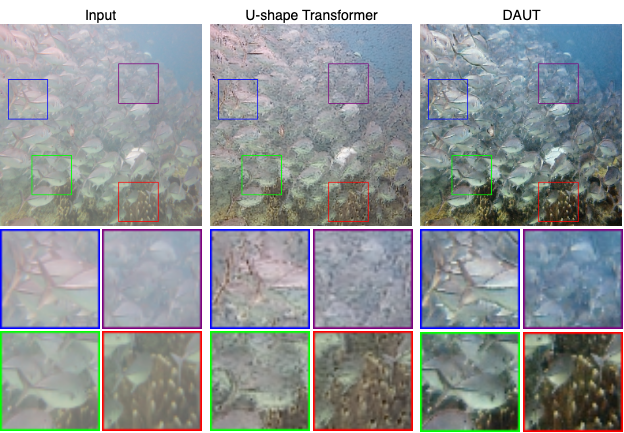
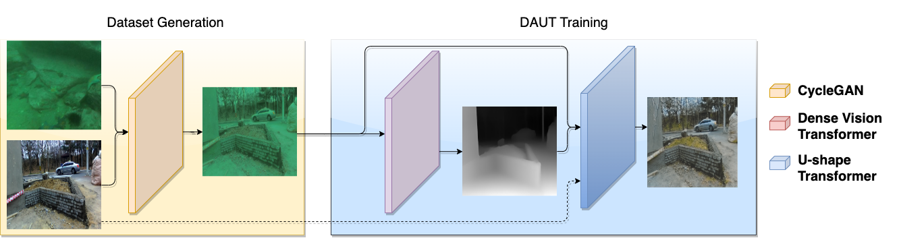
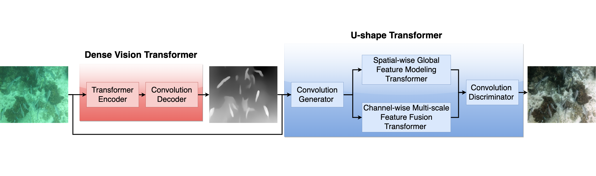

# Depth-Aware-U-shape-Transformer (DAUT)
Underwater Image Enhancement using Depth Aware U-shape Transformer

The official implementation of (DAUT) depth aware U-shape transformer.

based on u-shape transformer  [paper](https://arxiv.org/abs/2111.11843), [implementation](https://github.com/LintaoPeng/U-shape_Transformer_for_Underwater_Image_Enhancement)

and uses (DPT) Vision Transformers for Dense Prediction
[paper](https://arxiv.org/abs/2103.13413
), [implementation](https://github.com/isl-org/DPT)

below visual comparison between DAUT against U-shape Transformer and other physical and non-physical model enhancement methods, enhancing sampled images from our test dataset of different water types. it can be seen DAUT achieves state-of-the-art results.

  

  

### Setup 
install required dependencies from requirement.txt 

### Training

  
<!--   
<b>Training Pipeline of Our Depth Aware U-shape Transformer Network</b>
 -->

dataset will be uploaded

### Testing 

  
<!--   
<b>The Depth Aware U-shape Transformer Network</b>
 -->

#### Estimate depth maps for underwater images
1. Download DPT model [weight](https://drive.google.com/drive/folders/1gcgNg40FXWJpCSKiWokcKQzWjio1QtlK?usp=share_link) and put it in DPT/weights/
2. Put underwater images in DPT/input/
3. Run python DPT/run_segmentation.py
4. Depth maps will be created in DPT/output_monodepth/ 
5. Move Depth images “*.png” and put them in test/depth/

#### Enhance underwater images 
1. Download DAUT model [weight](https://drive.google.com/drive/folders/1fnWEzuvDmu9gfJWAUZbVY3-_h6E_Gntb?usp=share_link) and put it in saved_models/G/
2. Put underwater images in test/input/  "along with depth images in test/depth/"
3. Run test.ipynb
4. Enhanced images will be in test/output/

We provided few sample images with their depth for testing in test directory so you can run test.ipynb after downloading DAUT’s weights only
